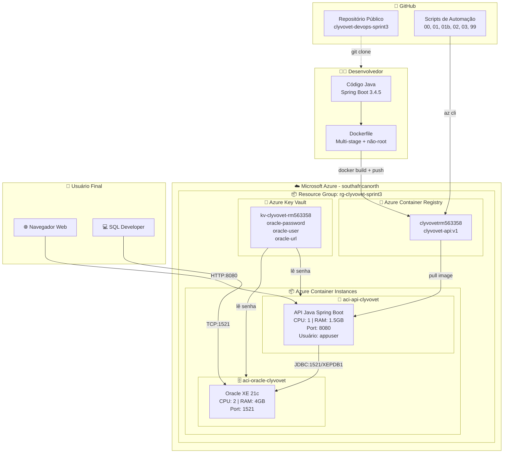

# 🐾 CLYVO VET — Sprint 3 DevOps

API RESTful desenvolvida para o **Challenge FIAP 2026** em parceria com a **Clyvo Vet**, containerizada e implantada na Microsoft Azure utilizando **Azure Container Registry (ACR)** e **Azure Container Instances (ACI)**.

---

## 👥 Integrantes

| Nome | RM |
|------|-----|
| Gustavo Barrios de Araujo | RM 563358 |
| Matheus Almeida Ribeiro | RM 562980 |
| Phietro Solon Oliveira | RM 563842 |

**Turma:** 2TDSPW
**Curso:** Análise e Desenvolvimento de Sistemas
**Disciplina:** DevOps Tools & Cloud Computing

---

## 📖 Descrição da Solução

O projeto foi desenvolvido para o Challenge FIAP 2026 em parceria com a empresa **Clyvo Vet**. O desafio proposto é transformar a jornada de saúde animal de um modelo **episódico e reativo** para uma experiência **contínua, preventiva, inteligente e integrada**.

Hoje o tutor só leva o pet ao veterinário em momentos pontuais como vacinas, emergências ou exames solicitados. Não existe continuidade no cuidado, o que gera esquecimento de vacinas, abandono de tratamentos, falta de orientação e baixa previsibilidade para clínicas e hospitais veterinários.

O **ClyvoVet** é uma API RESTful que **centraliza toda a jornada de saúde do pet em um único sistema**, conectando tutores, clínicas e veterinários. O sistema permite registrar e acompanhar consultas, vacinas, medicamentos e exames, além de gerar **alertas automáticos de saúde** como vacina vencida, retorno pendente e medicamento acabando.

---

## 💼 Benefícios para o Negócio

- **Continuidade no cuidado:** transforma a jornada episódica em acompanhamento contínuo;
- **Prevenção ativa:** alertas automáticos evitam esquecimento de vacinas e retornos;
- **Redução de abandono de tratamento:** notificações de medicamentos acabando;
- **Histórico longitudinal completo:** todas as informações do pet em um único lugar;
- **Conexão integrada:** tutores, clínicas e veterinários conectados em uma única plataforma;
- **Inteligência de dados:** base para análises preditivas e personalização;
- **Escalabilidade em nuvem:** arquitetura containerizada permite escalar conforme demanda;
- **Segurança:** container não-root, variáveis de ambiente protegidas e Azure Key Vault.

---

## 🧩 Espaços da Jornada Cobertos

| Espaço | Cobertura no Sistema |
|--------|----------------------|
| **Preventivo** | Vacinas, consultas preventivas e alertas de prevenção |
| **Continuidade Clínica** | Consultas de retorno, medicamentos ativos e exames |
| **Emergência e Risco** | Consultas de emergência e alertas críticos |
| **Relacionamento** | Conexão entre tutores, clínicas e veterinários |
| **Inteligência e Dados** | Alertas automáticos e histórico longitudinal do pet |

---

## 🏗️ Arquitetura da Solução

A solução foi implementada com a opção **ACR + ACI** (aplicação e banco totalmente containerizados):



**Fluxo do deploy:**

1. Desenvolvedor faz `docker build` e `docker push` da imagem para o ACR
2. O ACI baixa a imagem do ACR automaticamente
3. Os scripts leem a senha do Oracle do **Azure Key Vault** em tempo de execução
4. A API se comunica com o Oracle via rede interna do Azure
5. Usuário acessa a aplicação via FQDN público do ACI

---

## 🛠️ Tecnologias Utilizadas

| Camada | Tecnologia |
|--------|------------|
| **Backend** | Java 21 + Spring Boot 3.4.5 |
| **Persistência** | Spring Data JPA + Hibernate |
| **Banco de Dados** | Oracle XE 21c (container) |
| **Validação** | Bean Validation |
| **Cache** | Spring Cache |
| **Segurança** | Spring Security |
| **Documentação** | SpringDoc OpenAPI (Swagger UI) |
| **Boilerplate** | Lombok |
| **Build** | Gradle |
| **Container** | Docker (multi-stage, usuário não-root) |
| **Cloud** | Microsoft Azure |
| **Registry** | Azure Container Registry (ACR) |
| **Orquestração** | Azure Container Instances (ACI) |
| **Segredos** | Azure Key Vault |
| **CLI** | Azure CLI |

---

## 🗄️ Entidades do Sistema

| Entidade | Descrição | Relacionamentos |
|----------|-----------|-----------------|
| **Tutor** | Responsável pelo pet (nome, CPF, email, telefone, data nasc., endereço) | 1 Tutor → N Pets |
| **Pet** | Animal cadastrado (nome, espécie, raça, data nasc., peso, sexo, castrado) | N Pets → 1 Tutor |
| **Clínica** | Estabelecimento veterinário (nome, CNPJ, email, telefone, endereço) | 1 Clínica → N Veterinários |
| **Veterinário** | Profissional (nome, CRMV, especialidade, email, telefone) | N Veterinários → 1 Clínica |
| **Consulta** | Atendimento (data/hora, tipo, status, diagnóstico, tratamento) | N Consultas → 1 Pet + 1 Veterinário |
| **Vacina** | Aplicação (nome, data, próxima dose, fabricante, lote) | N Vacinas → 1 Pet |
| **Medicamento** | Prescrição (nome, dosagem, frequência, datas, status) | N Medicamentos → 1 Pet |
| **Exame** | Exame (tipo, data, resultado, URL) | N Exames → 1 Pet |
| **Alerta de Saúde** | Alerta automático (tipo, mensagem, data, lido) | N Alertas → 1 Pet |
| **Usuário** | Autenticação (email, senha, role) | Tutor ou Veterinário |

---

## 📁 Estrutura do Repositório

```
clyvovet-devops-sprint3/
├── README.md
├── Dockerfile              # Build multi-stage, usuário não-root
├── script_bd.sql           # DDL completo das tabelas Oracle
├── build.gradle            # Configuração do Gradle
├── settings.gradle
├── gradlew / gradlew.bat
├── src/                    # Código-fonte Java
├── documents/              # Documentação e diagramas
└── scripts/                # Automação do deploy
    ├── 00_setup.sh
    ├── 01_build-push.sh
    ├── 01b_key-vault.sh
    ├── 02_aci-oracle.sh
    ├── 03_aci-api.sh
    └── 99_delete-all.sh
```

---

## 🚀 Passo a Passo do Deploy (How To)

### Pré-requisitos

- **Azure CLI** instalado
- **Docker** instalado
- **Conta Azure** ativa
- **Acesso ao Cloud Shell** ou terminal Linux

### Passo 1 — Clone do Repositório

```bash
git clone https://github.com/PhietroSolonoo/clyvovet-devops-sprint3.git
cd clyvovet-devops-sprint3
chmod +x scripts/*.sh
```

### Passo 2 — Setup (Resource Group + ACR)

```bash
./scripts/00_setup.sh
```

**O que faz:**
- Cria o Resource Group `rg-clyvovet-sprint3` na região `southafricanorth`
- Registra os providers necessários
- Cria o ACR `clyvovetrm563358`

### Passo 3 — Build + Push da Imagem

```bash
./scripts/01_build-push.sh
```

**O que faz:**
- Login no ACR
- Build da imagem Docker `clyvovet-api:v1`
- Push da imagem para o ACR

### Passo 4 — Key Vault (Segredos Protegidos)

```bash
./scripts/01b_key-vault.sh
```

**O que faz:**
- Cria o Key Vault `kv-clyvovet-rm563358`
- Solicita a senha do Oracle de forma interativa
- Armazena a senha como segredo no Key Vault

**⚠️ A senha do Oracle nunca fica hardcoded nos scripts nem no repositório.**

### Passo 5 — ACI do Oracle

```bash
./scripts/02_aci-oracle.sh
```

**O que faz:**
- Lê a senha do Key Vault
- Cria o container `aci-oracle-clyvovet` com Oracle XE 21c

**Aguardar o Oracle subir (5-10 min):**

```bash
az container logs --resource-group rg-clyvovet-sprint3 --name aci-oracle-clyvovet --follow
```

Aguarde a mensagem `DATABASE IS READY TO USE!` e aperte `Ctrl+C`.

### Passo 6 — ACI da API

```bash
./scripts/03_aci-api.sh
```

**O que faz:**
- Lê a senha do Key Vault
- Cria o container `aci-api-clyvovet` com a imagem do ACR
- Passa as variáveis de ambiente para conexão com o Oracle

**Aguardar a API subir (30s):**

```bash
az container logs --resource-group rg-clyvovet-sprint3 --name aci-api-clyvovet --follow
```

Aguarde a mensagem `Started ClyvovetApplication` e aperte `Ctrl+C`.

### Passo 7 — Acessar a Aplicação

Abra no navegador:

```
http://aci-api-clyvovet.southafricanorth.azurecontainer.io:8080/login
```

**Contas de demonstração (públicas):**

| Perfil | E-mail | Senha |
|--------|--------|-------|
| Tutor | `tutor@clyvovet.com.br` | `tutor123` |
| Veterinário | `veterinario@clyvovet.com.br` | `vet123` |

### Passo 8 — Verificação de Persistência no Banco

Para verificar que os dados foram persistidos no Oracle:

**1. Obtenha a senha do Oracle do Key Vault:**

```bash
az keyvault secret show \
  --vault-name kv-clyvovet-rm563358 \
  --name oracle-password \
  --query value -o tsv
```

**2. Obtenha o IP público do Oracle:**

```bash
az container show \
  --resource-group rg-clyvovet-sprint3 \
  --name aci-oracle-clyvovet \
  --query ipAddress.ip -o tsv
```

**3. Conecte no SQL Developer com:**

| Campo | Valor |
|-------|-------|
| **Host** | IP obtido acima |
| **Porta** | `1521` |
| **Nome do Serviço** | `XEPDB1` |
| **Usuário** | `system` |
| **Senha** | Senha obtida do Key Vault |

**4. Execute o SELECT:**

```sql
SELECT id, nome, especie, raca FROM tb_pet;
```

### Passo 9 — Limpeza

```bash
./scripts/99_delete-all.sh
```

---

## 🧪 Testes do CRUD

Após o deploy, faça login com uma das contas de demonstração e teste:

- **Create:** Cadastrar um novo pet
- **Read:** Visualizar o pet na listagem
- **Update:** Editar informações do pet
- **Delete:** Excluir o pet

**Após cada operação, verifique no banco Oracle** (via SQL Developer) que a alteração foi persistida.

---

## 🐳 Comandos Docker Utilizados

```bash
# Build da imagem
docker build -t clyvovet-api:v1 .

# Login no ACR
az acr login --name clyvovetrm563358

# Tag da imagem para o ACR
docker tag clyvovet-api:v1 clyvovetrm563358.azurecr.io/clyvovet-api:v1

# Push da imagem para o ACR
docker push clyvovetrm563358.azurecr.io/clyvovet-api:v1
```

---

## 🔒 Segurança

- ✅ Container da aplicação roda como **usuário não-root** (`appuser`);
- ✅ Credenciais passadas via **variáveis de ambiente** (nunca hardcoded no código Java);
- ✅ Senha do Oracle armazenada no **Azure Key Vault**;
- ✅ Scripts de deploy leem a senha do Key Vault em tempo de execução;
- ✅ ACR com autenticação via **Azure AD**;
- ✅ Senha do banco **não** versionada no repositório.

---

## 🎥 Vídeo Demonstrativo

🔗 **[Assistir no YouTube](https://youtu.be/Ucy8ng4MNQc)**

---

## 📄 Licença

Projeto acadêmico desenvolvido para o **Challenge FIAP 2026** em parceria com a **Clyvo**.
